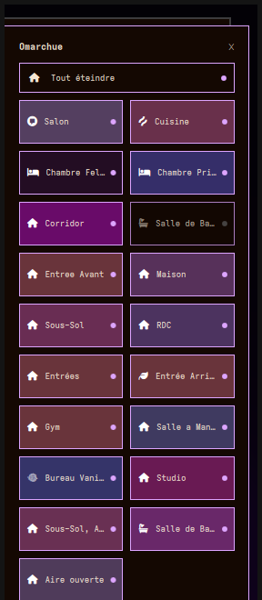

# Omarchue for Omarchy

Philips Hue control for Omarchy, in the style of the Android Hue app.
A bar icon opens a panel of color-tinted room tiles; tap a tile to walk
into the room and drive every bulb — power, brightness, white
temperature or a full color wheel, and scenes that actually *play*,
animating the lights through their palette just like the official app.



## What's included

| Piece | What it does |
| --- | --- |
| **Room grid** (`RoomGrid.qml` + `RoomTile.qml`) | Android-app home level: a "Tout" tile for whole-house on/off, then one tinted tile per room/zone with a class glyph and a live on/off dot |
| **Room view** (`RoomView.qml`) | Room power + brightness, scene chips, and one row per bulb |
| **Light rows** (`LightRow.qml`) | Per-bulb toggle and brightness; White Ambiance bulbs get a temperature gradient, RGB bulbs get a shader color wheel — capability flags come straight from the bridge, so any bulb type does the right thing |
| **Dynamic scenes** (`SceneChip.qml`) | Scenes with a color palette carry a play mark; tap to start the animated palette, tap again to stop. Playback state resyncs from the bridge, so the official app and the panel agree |
| **Bar widget** (`BarWidget.qml`) | Lightbulb icon — amber while any light is on, red while the bridge is unreachable. Left click opens the panel, right click kills every light |
| **Bridge helper** (`hue_api.py` + `tests/`) | Stdlib-only Python helper: TLS pinned to the bridge's Signify CA, mDNS discovery, streaming pairing, v1 state normalization and CLIP v2 dynamic playback. 54 headless tests |

## How it works

- **The bridge helper is a subprocess, not HTTP-in-QML.** Hue bridges
  serve TLS with their own Signify CA and name themselves by bridge id,
  not IP — things a QML XMLHttpRequest cannot pin or resolve. The helper
  speaks v1 for state and CLIP v2 for dynamic scenes, and reports
  machine JSON with strict exit codes (ok / network / unpaired / bad
  response).
- **State lives in a service.** The shell destroys panels on close, so
  `HueService.qml` owns the model, the polling and the serialized action
  queue; the panel and bar widget are pure views. Polls pause while you
  drag a slider, and a network blip never wipes the room list.
- **Optimistic UI, honest reconciliation.** Toggles and drags update the
  panel instantly, the command queue coalesces by target, and a resync
  a beat later lets bridge reality catch up.
- **Credentials stay put.** The application key is stored atomically,
  mode 0600, in `~/.local/state/omarchy/settings/hue.json`; it never
  appears in argv, QML strings or logs.

## Install

```
omarchy plugin install Realrandombacon/omarchue
```

(or clone into `~/.config/omarchy/plugins/` and run `./deploy.sh`).
Open the panel from the bar's lightbulb icon, press the pairing button
on your bridge when asked, done. A handy keybinding, if you want one:

```
# ~/.config/hypr/bindings.lua
o.bind("SUPER + ALT + H", "Hue panel",
       "omarchy-shell shell toggle io.github.realrandombacon.omarchue")
```

Headless control also works without the panel:

```
omarchy-shell omarchue set '{"allOn": false}'
omarchy-shell omarchue set '{"group":"1","bri":120}'
omarchy-shell omarchue status
```

## Notes

- Bulb capability detection is per-light (brightness / temperature /
  color), so White, White Ambiance and Color bulbs all show only the
  controls they can actually use; unreachable bulbs are visible but
  inert.
- Room tiles are tinted with the average chromaticity of the lit bulbs,
  so the grid reads like a floor plan of what's glowing.
- Dynamic-scene playback uses the bridge's own speed (set it in the Hue
  app); scene recall and playback stop are bridge-native, no timers.

## License

MIT — see [LICENSE](LICENSE).